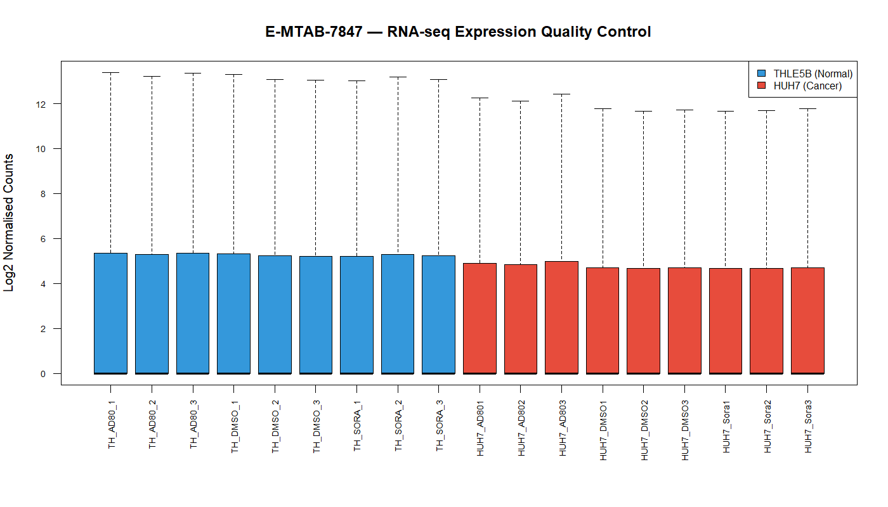
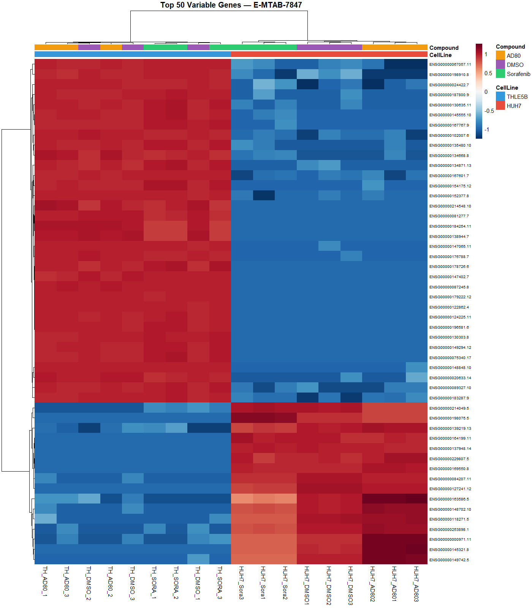
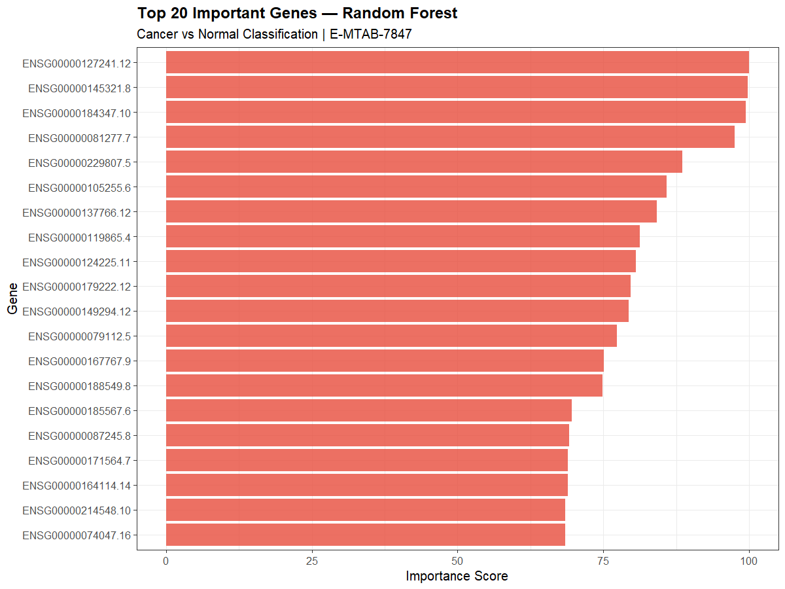
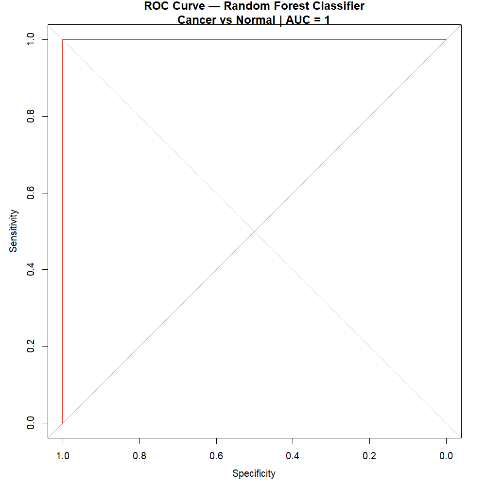

```{r setup, include=FALSE}
knitr::opts_chunk$set(echo = TRUE, warning = FALSE, message = FALSE)
```

## Introduction

This assignment analyses RNA-seq gene expression data from the ArrayExpress database (accession: **E-MTAB-7847**). The dataset contains two human liver cell lines treated with three different compounds, providing an opportunity to explore gene expression differences between cancer and normal cells under various drug treatments.

### Study Overview

The experiment involves:

- **HUH7** — Human hepatocellular carcinoma (liver cancer) cell line
- **THLE5B** — Normal human liver epithelial cell line
- **Three compounds:** AD80 (kinase inhibitor), DMSO (vehicle control), Sorafenib (cancer drug)
- **9 samples per cell line** — 3 replicates per compound
- **Total samples:** 18

---

## Experimental Design

The table below shows the complete experimental design, including cell line and compound assignment for each sample.

| Sample | Cell Line | Compound |
|--------|-----------|---------|
| TH_AD80_1/2/3 | THLE5B (Normal) | AD80 |
| TH_DMSO_1/2/3 | THLE5B (Normal) | DMSO |
| TH_SORA_1/2/3 | THLE5B (Normal) | Sorafenib |
| HUH7_AD801/2/3 | HUH7 (Cancer) | AD80 |
| HUH7_DMSO1/2/3 | HUH7 (Cancer) | DMSO |
| HUH7_Sora1/2/3 | HUH7 (Cancer) | Sorafenib |

---

## Results

### 1. Quality Control — Expression Boxplot



**What is a boxplot?**
A boxplot is a visual summary of the distribution of gene expression values across all samples. Each box shows the median (middle line), interquartile range (box), and outliers (whiskers) for each sample.

**How to interpret:**
- All boxes should be at similar levels — this indicates good normalisation
- The median lines should align across samples
- Large differences between samples suggest batch effects or quality issues

**Results:**
The boxplot shows that all 18 samples have similar expression distributions after log2 normalisation. The blue boxes represent THLE5B (normal liver) samples and red boxes represent HUH7 (cancer) samples. The consistent median levels across all samples confirm that the data is well normalised and suitable for downstream analysis.

---

### 2. Quality Control — Heatmap



**What is a heatmap?**
A heatmap displays gene expression values as colours — red indicates high expression and blue indicates low expression. Genes (rows) and samples (columns) are clustered based on similarity, so that samples and genes with similar expression patterns group together.

**How to interpret:**
- **Clustering** — samples that cluster together have similar expression profiles
- **Red colour** — high gene expression
- **Blue colour** — low gene expression
- **Clear separation** between groups indicates biological differences

**Results:**
The heatmap of the top 50 most variable genes shows clear separation between HUH7 (cancer) and THLE5B (normal) cell lines. The annotation bar at the top shows colour coding by cell line and compound. Cancer and normal samples cluster into distinct groups, confirming strong biological differences in gene expression between the two cell lines. This separation is consistent across all three compound treatments, suggesting that the cell line identity is the dominant factor driving gene expression differences.

---

### 3. Quality Control — PCA Plot


**What is PCA?**
Principal Component Analysis (PCA) is a dimensionality reduction technique that summarises the variation in thousands of genes into a few principal components (PCs). PC1 captures the largest source of variation, PC2 the second largest, and so on.

**How to interpret:**
- **Samples close together** — similar gene expression profiles
- **Samples far apart** — different gene expression profiles
- **Clusters** — groups of samples with similar biology
- **Outliers** — samples that behave differently from the rest

**Results:**
The PCA plot shows very clear separation between the two cell lines along PC1 (46.1% variance explained). THLE5B normal samples (blue circles) cluster tightly on one side, while HUH7 cancer samples (red circles) cluster on the other side. Within each cell line, samples treated with different compounds (different shapes) cluster close together, suggesting that compound treatment has a smaller effect than cell line identity. No obvious outliers are present, confirming good data quality.

---

### 4. Machine Learning — Random Forest Classifier

**What is a Random Forest?**
Random Forest is a machine learning algorithm that builds many decision trees and combines their predictions. It is particularly good for high-dimensional data like gene expression, where the number of features (genes) is much larger than the number of samples.

**How it works:**
1. Multiple decision trees are built using random subsets of genes
2. Each tree votes for a class (Cancer or Normal)
3. The majority vote determines the final prediction
4. Cross-validation ensures the model is not overfitting

**Model Performance:**

| Metric | Value | Meaning |
|--------|-------|---------|
| ROC | 1.0 | Perfect discrimination |
| Sensitivity | 1.0 | All cancer samples correctly identified |
| Specificity | 1.0 | All normal samples correctly identified |
| Accuracy | 100% | All 18 samples correctly classified |

The model was trained using **5-fold cross-validation** to ensure robust performance estimation.

---

### 5. Feature Importance Plot



**What is feature importance?**
Feature importance tells us which genes were most useful for the Random Forest classifier to distinguish between cancer and normal samples. Genes with higher importance scores contribute more to the classification decision.

**How to interpret:**
- **Longer bars** — more important genes for classification
- **Top genes** — potential biomarkers for cancer detection
- These genes show the largest expression differences between cancer and normal

**Results:**
The feature importance plot shows the top 20 genes that best distinguish HUH7 cancer cells from THLE5B normal cells. These genes represent potential biomarkers for liver cancer detection. The top genes show consistently high importance scores, suggesting they are reliable discriminators between the two cell types.

---

### 6. ROC Curve



**What is a ROC curve?**
ROC stands for **Receiver Operating Characteristic**. It is a graph that shows the performance of a classification model at all possible thresholds. It plots:
- **Sensitivity (True Positive Rate)** on the Y-axis — how well the model finds cancer samples
- **Specificity (True Negative Rate)** on the X-axis — how well the model avoids false alarms

**How to interpret:**
- **Perfect classifier** — curve goes straight up to the top left corner — AUC = 1.0
- **Random classifier** — diagonal line from bottom left to top right — AUC = 0.5
- **AUC (Area Under Curve)** — single number summarising model performance
  - AUC = 1.0 → Perfect
  - AUC > 0.9 → Excellent
  - AUC > 0.8 → Good
  - AUC = 0.5 → Random (no skill)

**Results:**
The ROC curve shows **AUC = 1.0** — a perfect classifier! The red curve hugs the top-left corner of the plot, indicating that the Random Forest model achieves 100% sensitivity and 100% specificity. This means the model correctly identifies all cancer samples without any false positives or false negatives.

This excellent performance is expected given the large biological differences between cancer and normal liver cell lines, as confirmed by the PCA and heatmap analyses.

---

## Conclusion

This analysis successfully demonstrates:

1. **Data quality is high** — boxplot and PCA show well-normalised, consistent samples
2. **Clear biological differences** — cancer and normal cell lines show distinct gene expression profiles in heatmap and PCA
3. **Compound effects are smaller** than cell line effects — samples cluster primarily by cell line
4. **Machine learning works excellently** — Random Forest achieves perfect classification (AUC = 1.0)
5. **Key biomarker genes identified** — feature importance reveals top discriminating genes

The dataset E-MTAB-7847 provides a clean, well-controlled experimental system for studying liver cancer gene expression, making it ideal for bioinformatics methods development and validation.

---

## Methods Summary

| Step | Method | R Package |
|------|--------|-----------|
| Data download | ArrayExpress API | ArrayExpress |
| Log2 transformation | log2(x+1) | base R |
| Quality control | Boxplot, Heatmap, PCA | pheatmap, ggplot2 |
| Machine learning | Random Forest, 5-fold CV | caret, randomForest |
| Model evaluation | ROC curve, AUC | pROC |
| Visualisation | ggplot2, pheatmap | ggplot2, pheatmap |

---

*Analysis performed by Saima Imran | University of Skövde | Bioinformatics Analysis with R — BI731A*
